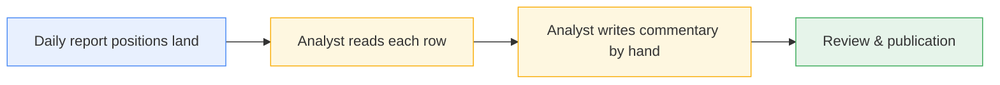
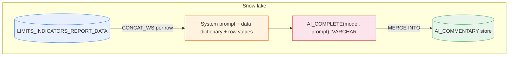
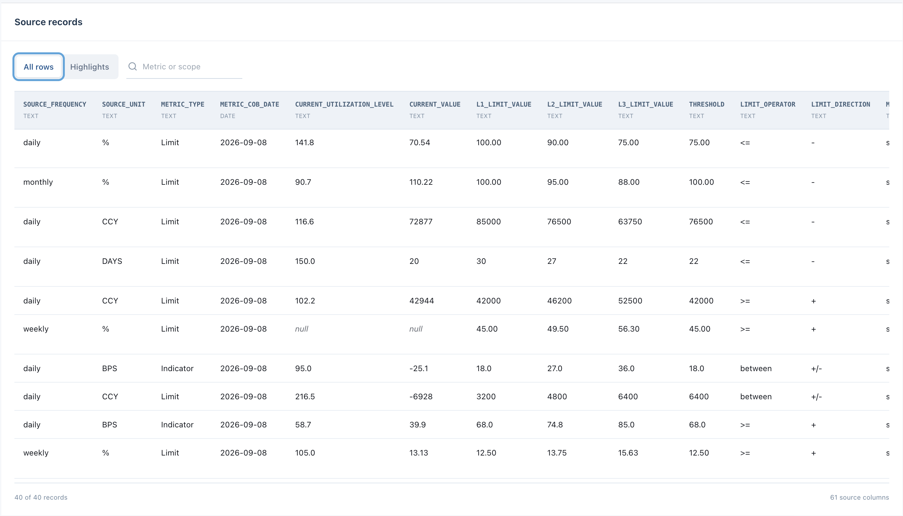
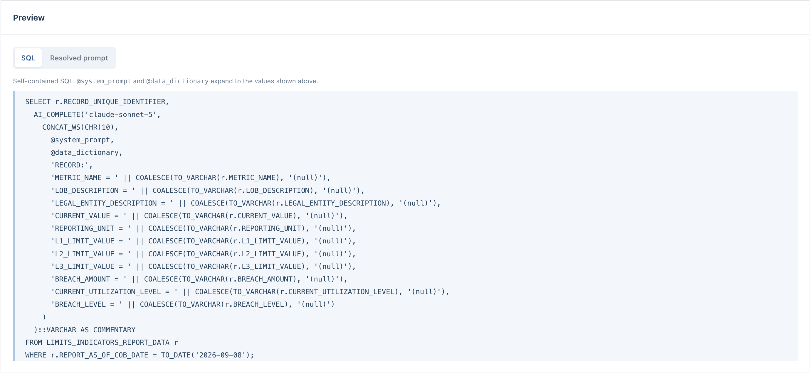
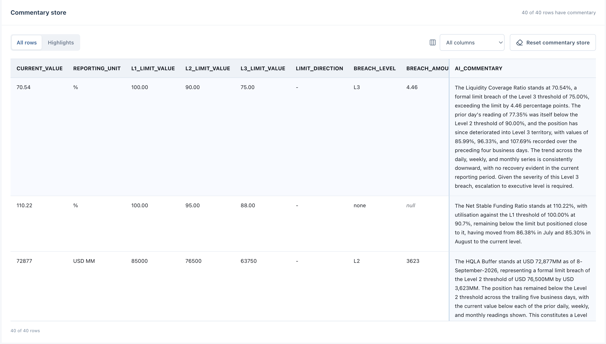

# Automated commentary with Cortex AI Functions

GlobalTrust Financial Group is a fictional liquidity-risk reporting demo.
The main story is simple: **Base table -> AI_COMPLETE -> Commentary store -> Analyst review**.
Start with existing report rows, concatenate labelled column values with instructions,
choose a model, and generate a first draft. 

## Business workflow



The manual step — reading source metrics and writing prose — is the target for automation.
Everything before (data landing) and after (review and sign-off) stays human-owned.

## Cortex AI data flow



One SQL SELECT with AI_COMPLETE generates commentary for each row.

## Demo walkthrough

### 01 / Report & Problem

The source report:



### 02 / Build the SQL

Select source columns, view the data dictionary, inspect the system prompt (preamble + 9 rules), choose an LLM, and preview the generated SQL or resolved prompt.



### 03 / Commentary Results

Generate all rows with AI_COMPLETE, review AI-drafted commentary alongside metric context, and reset or regenerate as needed.



## Deploy

```bash
# 1. Create the Snowflake objects
snowflake/build.sh <connection>   # creates LRI_DEMO database, schema, warehouse, and all objects (01-10)

# 2. Configure the Express server connection
cp server/.env.example server/.env
# Edit server/.env with your Snowflake credentials:
#   SNOWFLAKE_ACCOUNT   — org-account identifier (e.g. MYORG-MYACCOUNT)
#   SNOWFLAKE_USER      — Snowflake username
#   SNOWFLAKE_ROLE      — role with access to LRI_DEMO (default: SYSADMIN)
#   SNOWFLAKE_WAREHOUSE — warehouse name (default: LRI_DEMO_WH)
#   SNOWFLAKE_DATABASE  — database name (default: LRI_DEMO)
#   SNOWFLAKE_SCHEMA    — schema name (default: LRI_BASE)
#
# Authentication — choose one:
#   Key-pair (default): set SNOWFLAKE_AUTHENTICATOR=SNOWFLAKE_JWT
#                       and SNOWFLAKE_PRIVATE_KEY_PATH to your .p8 key file
#   Password:           set SNOWFLAKE_PASSWORD and remove the authenticator/key lines

# 3. Install and run
npm install
npm run dev                       # Express :3001 + Vite dev server
```

Replace `<connection>` with your Snowflake CLI connection name (see `snow connection list`).
The build script is idempotent (CREATE OR REPLACE throughout, deterministic seed data).


## Cleanup

Run `snowflake/cleanup.sql` to drop all demo objects and avoid recurring costs:

```bash
snow sql -c <connection> -f snowflake/cleanup.sql
```

## Handout

The `handout/` directory contains reusable assets that work independently of the demo app:

- **[HANDOUT.md](handout/HANDOUT.md)** — single-file guide covering setup, notebook walkthrough, key SQL patterns, and cleanup
- **[automated_commentary.ipynb](handout/automated_commentary.ipynb)** — Snowsight workspace notebook walking through the same flow: explore data, inspect prompts, call AI_COMPLETE, batch generate, review results

The notebook assumes the demo SQL objects have been deployed via `build.sh`.

